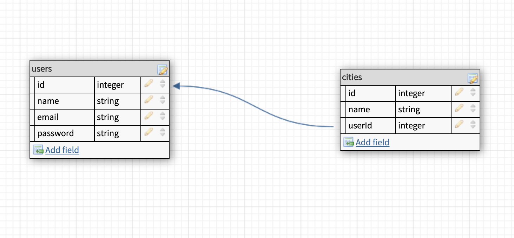
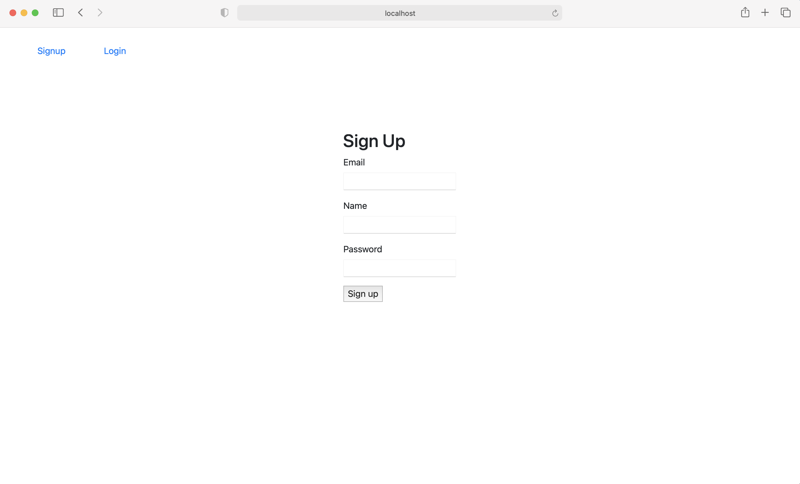
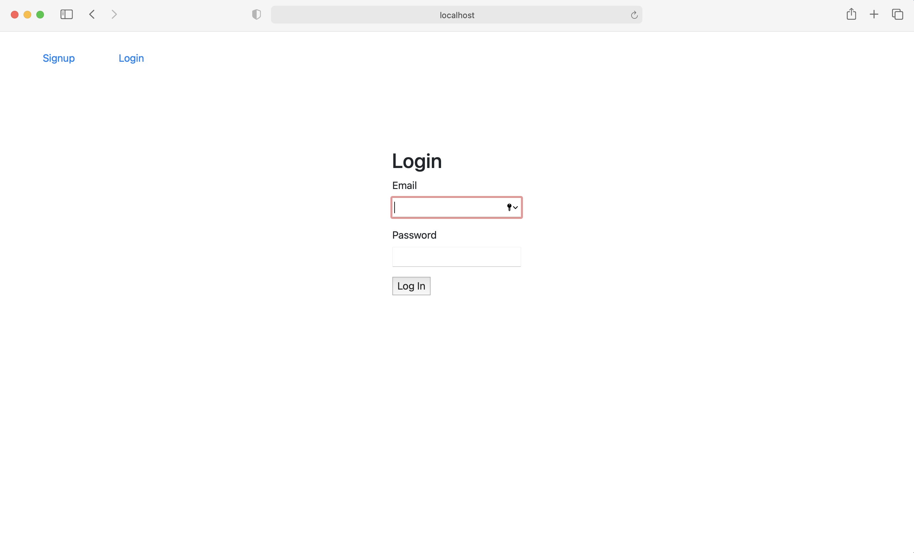
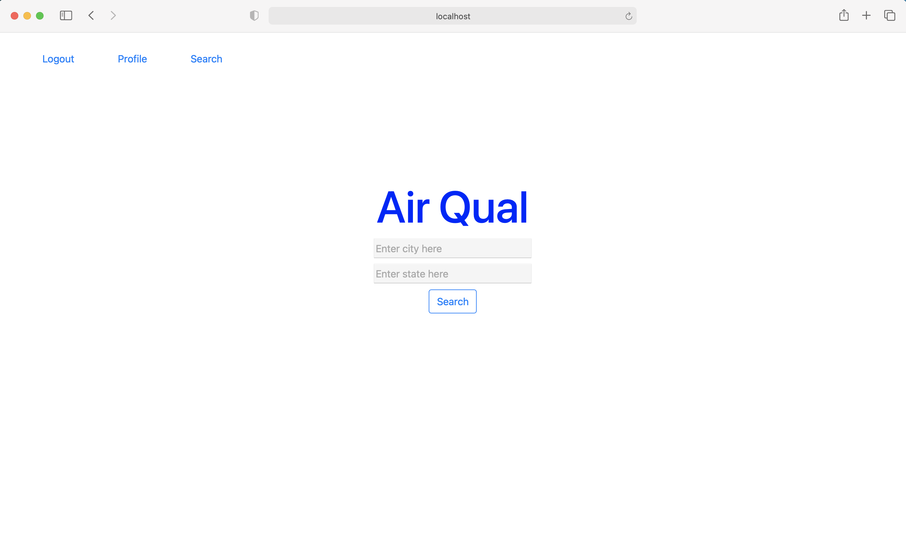
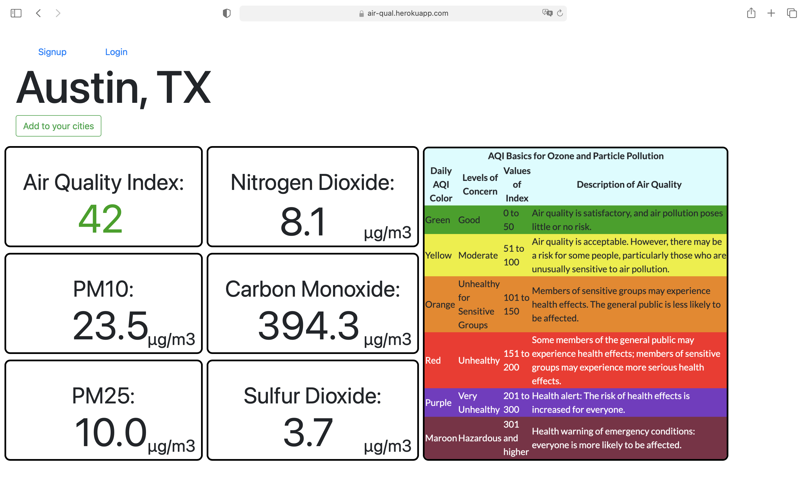
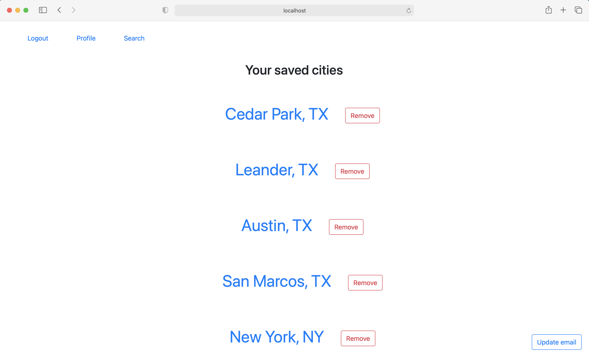
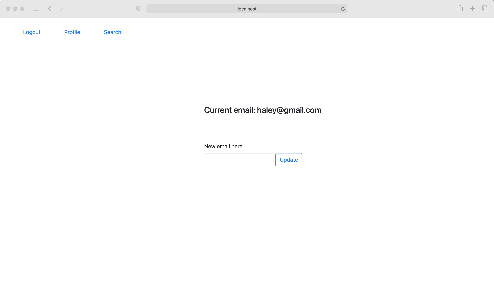

# Air Qual

An app that gets real-time air quality information and allows you to log in and have an account to add cities to your profile to have easier access to see that city's air quality.

## What it includes

- Sequelize user model / migration
- Settings for PostgreSQL
- Passport and passport-local for authentication
- Sessions to keep user logged in between pages
- Flash messages for errors and successes
- Passwords that are hashed with BCrypt
- EJS Templating and EJS Layouts
- Cookie sessions for keeping the user logged in

### User Model

| Column Name | Data Type | Notes                              |
| ----------- | --------- | ---------------------------------- |
| id          | Integer   | Serial Primary Key, Auto-generated |
| name        | String    | Must be provided                   |
| email       | String    | Must be unique / used for login    |
| password    | String    | Stored as a hash                   |
| createdAt   | Date      | Auto-generated                     |
| updatedAt   | Date      | Auto-generated                     |

### City Model

| Column Name | Data Type | Notes                                      |
| ----------- | --------- | ------------------------------------------ |
| id          | Integer   | Serial Primary Key, Auto-generated         |
| name        | String    | City that was typed into search            |
| state       | String    | State that was typed into search           |
| userId      | Integer   | Associated with the users id in user model |
| createdAt   | Date      | Auto-generated                             |
| updatedAt   | Date      | Auto-generated                             |



### Routes

| Method | Path                 | Location      | Purpose                   |
| ------ | -------------------- | ------------- | ------------------------- |
| GET    | /                    | server.js     | Home page                 |
| GET    | /auth/login          | auth.js       | Login form                |
| GET    | /auth/signup         | auth.js       | Signup form               |
| POST   | /auth/login          | auth.js       | Login user                |
| POST   | /auth/signup         | auth.js       | Creates User              |
| GET    | /auth/logout         | auth.js       | Removes session info      |
| PUT    | /update              | server.js     | Updates email info        |
| GET    | /profile             | server.js     | Regular User Profile      |
| POST   | /profile             | server.js     | Adds city to databse      |
| DELETE | /profile             | server.js     | Deletes city from databse |
| GET    | /airquality          | airquality.js | Search page               |
| GET    | /airquality/location | airquality.js | Results from search       |

## Renderings of pages








## The GET route grabbing data from the Weatherbit API in the airquality router

```js
airRouter.get("/location", (req, res) => {
  const citystate = req.query.location;
  const state = req.query.state;
  axios
    .get(
      `https://api.weatherbit.io/v2.0/current/airquality?city=${citystate},${state}&key=${process.env.AIR_API_KEY}`
    )
    .then((response) => {
      const air = response.data;
      res.render("airquality", { query: air });
    })
    .catch((error) => {
      console.log(error);
    });
});
```

## The POST route adding data to the city databse in the profile router

```js
profileRouter.post("/", (req, res) => {
  const { city_name } = req.body;
  const state = req.body.state_code;
  db.city
    .create({
      name: city_name,
      state: state,
      userId: req.user.id,
    })
    .then(() => {
      res.redirect("/profile");
    })
    .catch((error) => {
      console.log(error);
    });
});
```

## The GET route grabbing data from the city databse in the profile router

```js
profileRouter.get("/", (req, res) => {
  db.city
    .findAll({
      where: { userId: req.user.id },
    })
    .then((city) => {
      const cities = city.map((item) => {
        return item.dataValues;
      });
      res.render("profile", { cities });
    });
});
```

## The PUT route updating the user email from the user database in the server.js file

```js
app.put("/update", (req, res) => {
  db.user
    .update(
      {
        email: req.body.email,
      },
      {
        where: { id: req.user.id },
      }
    )
    .then(() => {
      res.redirect("/profile");
    });
});
```

## The DELETE route deleting data from the city databse in the profile router

```js
profileRouter.delete("/", (req, res) => {
  const { id } = req.body;
  db.city
    .findOne({
      where: { id: id },
    })
    .then((foundCity) => {
      foundCity.destroy().then(() => {
        res.redirect("/profile");
      });
    });
});
```

## Wireframes


## Steps To Install On Local Machine

#### 1. Fork and Clone to local machine using

```
https://github.com/JaxonNarramore/suncreen-or-no-sunscreen
```

#### 2. Go to the file in the terminal

#### 3. Install node modules from the package.json

```
npm install
```

(Or just `npm i` for short)

#### 4. Add a `.env` file with the following fields:

- SESSION_SECRET: Can be any random string; usually a hash in production
- PORT: Usually 3000 or 8000
- AIR-API_KEY: Must get an API key from [Weatherbit.io](https://www.weatherbit.io/api/airquality-current)
- COOKIE_KEY: Can be any random string; usually a hash in production

#### 10. Run server; make sure it works

```
nodemon
```

or

```
node index.js
```

## Contact with the creator

Email: jaxon_narramore@hotmail.com
